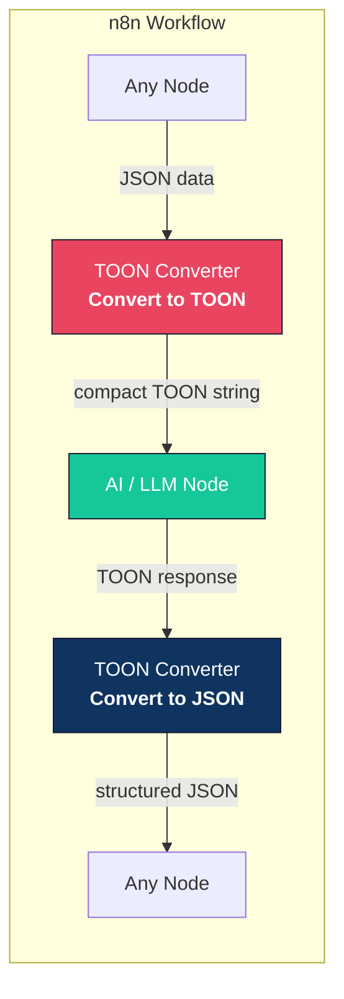
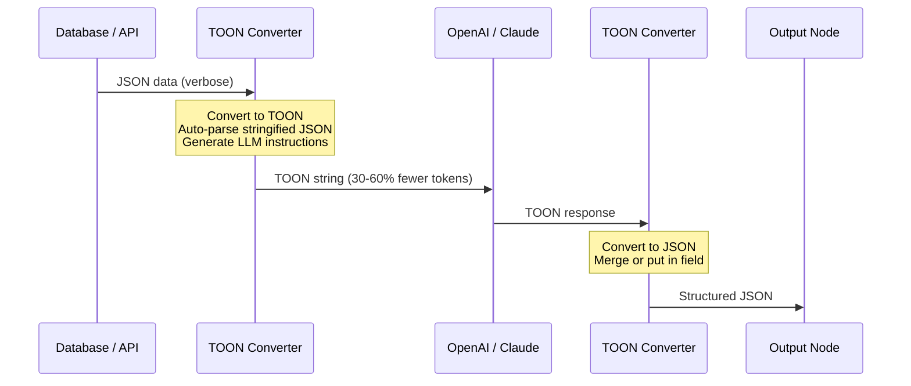
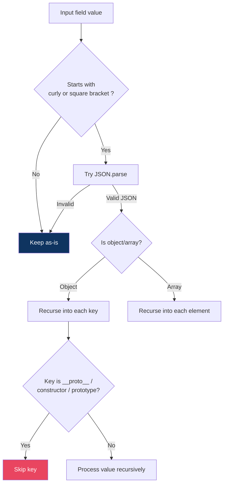
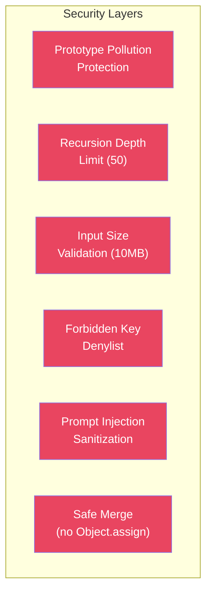

<p align="center">
  
</p>

<h1 align="center">n8n-nodes-toon-converter</h1>

<p align="center">
  <strong>n8n community node for converting between JSON and TOON</strong><br/>
  <em>Token-Oriented Object Notation — the format designed for LLMs</em>
</p>

<p align="center">
  <a href="https://www.npmjs.com/package/n8n-nodes-toon-converter"></a>
  <a href="https://github.com/arodriguezp2003/n8n-nodes-toon-converter/actions/workflows/ci.yml"></a>
  
  
  
  <a href="https://opensource.org/licenses/MIT"></a>
  
  
</p>

---

## What is TOON?

**TOON** (Token-Oriented Object Notation) is a data serialization format created to reduce the number of tokens when passing structured data to LLMs. Same data model as JSON — objects, arrays, strings, numbers, booleans, null — but with a compact, line-based syntax.

### Why does this matter?

Every token you send to an LLM costs money and counts against context limits. TOON solves this:

| Format | LLM Accuracy | Avg Tokens | vs JSON |
|--------|:------------:|:----------:|:-------:|
| **TOON** | **76.4%** | **2,759** | **-40%** |
| JSON (compact) | 73.7% | 3,104 | baseline |
| YAML | 74.5% | 3,749 | +21% |
| JSON (formatted) | 75.0% | 4,587 | +48% |

> *Benchmark: 209 data retrieval questions across 4 LLM models. Source: [toonformat.dev](https://toonformat.dev/)*

**Fewer tokens + higher accuracy = cheaper, faster, better AI workflows.**

### See the difference

<table>
<tr>
<td width="50%">

**JSON** — 149 tokens

```json
{
  "hikes": [
    {"id": 1, "name": "Blue Lake Trail",
     "km": 7.5, "sunny": true},
    {"id": 2, "name": "Ridge Overlook",
     "km": 9.2, "sunny": false},
    {"id": 3, "name": "Wildflower Loop",
     "km": 5.1, "sunny": true}
  ]
}
```

</td>
<td width="50%">

**TOON** — 45 tokens (**-70%**)

```
hikes[3]{id,name,km,sunny}:
  1,Blue Lake Trail,7.5,true
  2,Ridge Overlook,9.2,false
  3,Wildflower Loop,5.1,true
```

</td>
</tr>
</table>

---

## Architecture



### How the node fits in your workflow



---

## Node Operations

### Convert to TOON

Transforms JSON data into compact TOON format before sending to an LLM.

| Parameter | Description |
|-----------|-------------|
| **Source** | `Input Item` / `JSON Expression` / `JSON String` |
| **JSON Field** | Optional: convert only a specific field |
| **Output Field** | Where to store the TOON string (default: `toon`) |

### Convert to JSON

Parses TOON text back into structured JSON data.

| Parameter | Description |
|-----------|-------------|
| **TOON Source** | `Input Field` / `TOON String` |
| **Output Mode** | `Merge Into Item` / `Put in Field` |
| **Output Field** | Where to store the parsed data (default: `data`) |

### Options (both operations)

| Option | Default | Description |
|--------|:-------:|-------------|
| **Keep Source Fields** | `true` | Preserve original input fields in the output |
| **Auto-Parse Stringified JSON** | `false` | Detect and expand `JSON.stringify()`'d fields before encoding — lets TOON compress the inner structure |
| **Include LLM Format Instruction** | `false` | Add a `llmInstruction` field that explains the TOON format to the LLM (format only, no data) |

---

## Handling Stringified JSON

A common real-world pattern: your data has fields that contain `JSON.stringify()`'d values:

```json
{
  "user": "Ada",
  "preferences": "{\"theme\":\"dark\",\"lang\":\"es\"}"
}
```

### Without Auto-Parse (default)

The stringified JSON is treated as an opaque string — TOON wraps it in quotes:

```
user: Ada
preferences: "{\"theme\":\"dark\",\"lang\":\"es\"}"
```

### With Auto-Parse enabled

The node detects and expands stringified JSON fields before encoding:

```
user: Ada
preferences:
  theme: dark
  lang: es
```

This works recursively, handles double/triple stringified JSON, and is hardened against prototype pollution.



---

## LLM Format Instruction

When **Include LLM Format Instruction** is enabled, the node adds a `llmInstruction` field to the output. This is a **static, format-only explanation** of TOON syntax — it does NOT include any data.

Use it in your AI node's prompt **before** the TOON data:

```
{{ $json.llmInstruction }}

Here is the data:
{{ $json.toon }}

Now analyze this data and...
```

The instruction teaches the LLM how to read TOON: objects, tabular arrays, primitive arrays, and type inference rules — with inline syntax examples.

---

## Security

This node is security-hardened with protections against common attack vectors:



| Threat | Mitigation |
|--------|------------|
| **Prototype pollution** | `safeMerge()` replaces `Object.assign()` — skips `__proto__`, `constructor`, `prototype`. Objects built with `Object.create(null)`. |
| **Stack overflow (DoS)** | Recursion capped at depth 50. |
| **Memory bomb** | Input size validated at 10MB before parsing. |
| **Key injection** | Output field names validated against forbidden key denylist. |
| **Prompt injection** | Backtick sequences sanitized in LLM instruction generation. |
| **Silent data mutation** | No quoted-string unwrapping — only `{...}` and `[...]` patterns are parsed. |

### Dependency audit

| Package | Risk | Notes |
|---------|:----:|-------|
| `@toon-format/toon` | Low | 0 runtime deps, 0 install scripts, SLSA provenance, 23K+ GitHub stars |

---

## Test Suite

**79 tests** | **100% coverage** | **0 vulnerabilities**

```
 % Coverage report from v8
──────────────┬─────────┬──────────┬─────────┬─────────
File          │ % Stmts │ % Branch │ % Funcs │ % Lines
──────────────┼─────────┼──────────┼─────────┼─────────
All files     │     100 │      100 │     100 │     100
 converter.ts │     100 │      100 │     100 │     100
──────────────┴─────────┴──────────┴─────────┴─────────
```

### Test breakdown

| Suite | Tests | What it covers |
|-------|:-----:|----------------|
| `deepParseStringifiedJson` | 17 | JSON stringified fields, edge cases, unicode, whitespace |
| `convertToToon / convertToJson` | 3 | Direct conversion, auto-parse toggle |
| `TOON round-trip` | 13 | All JSON types: objects, arrays, primitives, nesting |
| `Stringified JSON handling` | 6 | With/without auto-parse, tabular data, special chars |
| `Full round-trip` | 4 | Complex nested data, stringified preservation |
| `Edge cases` | 10 | Empty values, unicode, 100-row arrays, API patterns |
| `LLM instructions` | 5 | Format generation, sample embedding |
| **Security: prototype pollution** | **8** | `__proto__`, `constructor`, `prototype` in all paths |
| **Security: recursion depth** | **2** | 60-level nesting, deeply nested stringify |
| **Security: input size** | **4** | Size validation, oversized rejection |
| **Security: prompt injection** | **3** | Backtick sanitization, normal content preservation |
| **Security: string mutation** | **3** | No silent `"42"` -> `42` coercion |
| **Security: global check** | **1** | `Object.prototype` cleanliness after all tests |

### CI Pipeline

Tests run on every push and PR via GitHub Actions across **Node.js 20 and 22**:

```yaml
# .github/workflows/ci.yml
jobs:
  test:       # Runs tests on Node 20, 22
  coverage:   # Generates coverage report
  typecheck:  # Strict TypeScript validation
```

---

## Installation

### Via n8n UI (recommended)

1. Go to **Settings > Community Nodes**
2. Click **Install**
3. Enter `n8n-nodes-toon-converter`
4. Restart n8n

### Via CLI

```bash
cd ~/.n8n
npm install n8n-nodes-toon-converter
# Restart n8n
```

### Docker

```dockerfile
FROM n8nio/n8n:latest
RUN cd /usr/local/lib/node_modules/n8n && \
    npm install n8n-nodes-toon-converter
```

---

## Workflow Examples

### 1. Compress data before LLM analysis

```
[PostgreSQL] → [TOON Converter: Convert to TOON] → [OpenAI Chat]
```

Save 30-60% tokens on every LLM call by converting query results to TOON first.

### 2. Instruct LLM to respond in TOON

Enable **Include LLM Instructions** and pass `llmOutputInstruction` in the system prompt. The LLM responds in TOON, saving output tokens too.

```
[TOON Converter] → [OpenAI: uses llmOutputInstruction] → [TOON Converter: Convert to JSON]
```

### 3. Auto-parse API responses with stringified JSON

APIs often return fields with `JSON.stringify()`'d values. Enable **Auto-Parse Stringified JSON** to let TOON compress the inner structure.

```
[HTTP Request] → [TOON Converter: auto-parse + convert] → [AI Agent]
```

---

## TOON Syntax Quick Reference

| Structure | Syntax |
|-----------|--------|
| **Object** | `key: value` (indented for nesting) |
| **Tabular array** | `key[N]{f1,f2}: ` + CSV rows |
| **Primitive array** | `key[N]: a,b,c` |
| **Mixed array** | `key[N]:` + `- item` per line |
| **String quoting** | Only when value contains `: , [ ] { }` or looks like a number/boolean |
| **Empty array** | `key[0]:` |

Full spec: [github.com/toon-format/spec](https://github.com/toon-format/spec)

---

## Project Structure

```
n8n-nodes-toon-converter/
  nodes/ToonConverter/
    ToonConverter.node.ts     # n8n node definition
    ToonConverter.node.json   # Codex metadata for n8n search
    converter.ts              # Pure conversion logic (100% tested)
  icons/
    toon.svg                  # Node icon
  tests/
    ToonConverter.test.ts     # 79 tests (functional + security)
  docs/                       # Extended documentation
  .github/workflows/
    ci.yml                    # Test + typecheck + coverage
    publish.yml               # npm publish with SLSA provenance
```

---

## Documentation

| Document | Description |
|----------|-------------|
| [What is TOON?](./docs/what-is-toon.md) | Format overview, benchmarks, when to use it |
| [Usage Guide](./docs/usage-guide.md) | Detailed node parameter reference |
| [Examples](./docs/examples.md) | Practical workflow patterns |
| [TOON Syntax Reference](./docs/toon-syntax-reference.md) | Complete syntax cheatsheet |
| [Installation Guide](./docs/installation.md) | All installation methods |

---

## Links

- [TOON Official Site](https://toonformat.dev/) — Format specification and benchmarks
- [TOON TypeScript SDK](https://github.com/toon-format/toon) — The library this node uses
- [n8n Community Nodes](https://docs.n8n.io/integrations/community-nodes/) — How community nodes work
- [TOON Spec](https://github.com/toon-format/spec) — Formal specification

---

## Contributing

```bash
git clone https://github.com/arodriguezp2003/n8n-nodes-toon-converter.git
cd n8n-nodes-toon-converter
npm install --ignore-scripts
npm run build    # Compile TypeScript
npm test         # Run 79 tests
```

---

## Author

**Alejandro Rodriguez** — [LinkedIn](https://www.linkedin.com/in/alejandrorodriguezpena/)

---

## License

[MIT](LICENSE)
